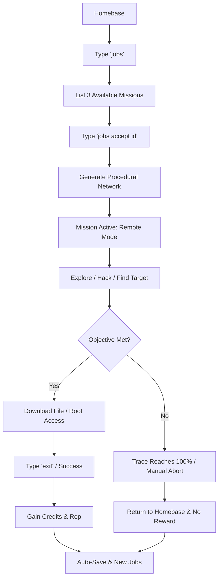

# Phase 3: Advanced Mission Loop - Implementation Plan

## Objective
Transition from a static, hardcoded mission to a procedural mission generation system where players can browse, accept, and complete varying tasks for rewards.

## 1. Data Structures (`types.ts`)
- [ ] Add `Mission` interface.
- [ ] Add `MissionConfig` interface for generator parameters.
- [ ] Update `PlayerState` to include `availableMissions: Mission[]`.
- [ ] Update `WinCondition` to include `file_stolen`.

## 2. Mission Generation (`services/MissionGenerator.ts`)
- [ ] Create `generateMissions(reputation: number): Mission[]`.
- [ ] Logic to select random scenarios from `gameData.ts`.
- [ ] Logic to scale difficulty (nodes, password length, trace speed) based on reputation.
- [ ] Generate unique IDs for missions.

## 3. Network Generation Refactor (`services/puzzleGenerator.ts`)
- [ ] Update `generateNetwork` to accept `MissionConfig`.
- [ ] Use `MissionConfig` to determine:
    - Number of nodes.
    - Complexity of puzzles.
    - Target file name and location.
    - Theme/Scenario selection.

## 4. Terminal Commands (`Terminal.tsx` & `CommandRegistry.ts`)
- [ ] **jobs**:
    - `jobs`: List missions from `playerState.availableMissions`.
    - `jobs accept <id>`: Start the selected mission.
- [ ] **download** / **scp**:
    - Usage: `download <filename>`.
    - Logic: Copy file from remote to `Localhost` VFS and `playerState.inventory`.
    - **Feature**: Allow downloading ANY file from the remote system into the player's inventory, **provided the player has read permissions** (e.g., if it's a root-only file and they are 'user', they can't download it).
    - **Constraint**: Add an `isEncrypted` property to some files (optional for future, but check permissions for now).
    - Check for "Win Condition" if the mission objective is to steal a specific file.
- [ ] Update `exit` / `abort`:
    - Ensure returning to Homebase correctly handles state transitions.

## 5. Game Loop & UI (`App.tsx`)
- [ ] Update `handleMissionAccept` to initialize the mission network and set `activeMissionId`.
- [ ] Implement `handleMissionComplete` (Win):
    - Calculate reward (Credits/Rep).
    - Update `PlayerState`.
    - Clear `activeMissionId`.
    - Refresh `availableMissions`.
    - Trigger Auto-Save.
- [ ] Implement `handleMissionFailure` (Loss):
    - Return to Homebase.
    - No reward (maybe a small rep penalty).
    - Trigger Auto-Save.

## 6. Persistence
- [ ] Ensure `availableMissions` are saved/loaded via `PersistenceService`.
- [ ] Ensure `inventory` is persisted.

## Mermaid Flow: Mission Loop

