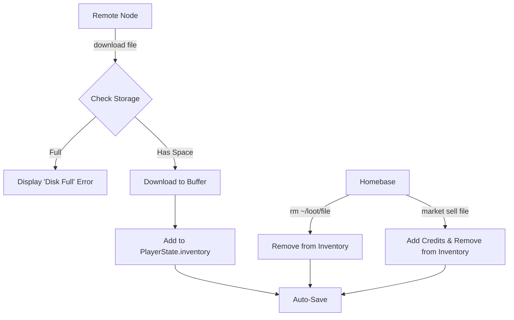

# Phase 5: Storage & Inventory - Detailed Subplan

## 📋 Overview
Phase 5 introduces resource management regarding data. Players will no longer have infinite storage for stolen data. They must manage their "Loot" by selling it at the market or deleting low-value files to make room for high-value targets.

## 🛠️ Data Model Changes

### 1. File Size Standardization (Realistic Sizing)
- All `File` objects in the VFS must have a `size` property (number, in MB).
- **Sizing Logic**: Files should have realistic sizes regardless of their actual string content length in the simulation.
    - **Clue/Text Files**: `0.1 MB` to `0.5 MB`.
    - **System Logs**: `1 MB` to `10 MB` (representing thousands of entries).
    - **Binaries/Executables**: `20 MB` to `1000 MB` (Up to 1GB for high-end software).
    - **Media/Videos/Images**: `5 MB` to `4000 MB` (Up to 4GB for encrypted video or high-res assets).
    - **Databases/Loot Targets**: `500 MB` to `8000 MB` (0.5GB to 8GB for major corporate leaks).
- **Implementation**: `puzzleGenerator.ts` will be updated to apply these ranges based on file extensions and content themes.

### 2. Storage Capacity
- `HardwareSpecs.storage.capacity` is in **GB**.
- Conversion: `1 GB = 1024 MB`.

---

## 🕹️ Command Updates

### 1. `ls` (List Files)
- Update `ls` to display file sizes when possible.
- Add support for `ls -l` (long format) to show permissions and sizes clearly.

### 2. `rm` (Remove File) - **NEW**
- **Usage:** `rm <filename>`
- **Logic:**
    - If on `Localhost`:
        - Remove file from the VFS.
        - If the file was in `~/loot/`, also remove it from `playerState.inventory`.
        - Trigger `onPlayerStateChange` and `Auto-Save`.
    - If on `Remote`:
        - Remove file from the remote VFS (useful for covering tracks or deleting traces, though primarily for player utility here).

### 3. `download` / `scp` (Resource Intensive)
- **New Constraint:** Storage Check.
    - Calculate `currentStorageUsage` = sum of all file sizes in `playerState.inventory`.
    - `if (currentUsage + newFile.size > hardware.storage.capacity * 1024) return "Error: Disk Full."`
- **Resource Utilization Refinement**:
    - **Network**: Download time must scale with `hardware.network.bandwidth`.
    - **Formula**: `delayMs = ((fileSizeMB / networkBandwidthMBps) * 1000) + (ProcessingTime / CPU_Multiplier)`.
    - **RAM**: Occupy RAM buffer during the process (`HARDWARE_CONFIG.DOWNLOAD_BASE_RAM + fileSizeGB`).
- **Persistence**: Ensure downloaded files are added to `playerState.inventory` upon completion.

---

## 💰 Market Integration

### 1. `market sell`
- **Usage:** `market sell <filename>`
- **Prerequisite:** Command only available on `Localhost`.
- **Logic:**
    - Verify file exists in `~/loot/` (and thus `playerState.inventory`).
    - Calculate sell price based on file size and mission difficulty (or fixed rate for now).
    - Add credits to `playerState.credits`.
    - Remove file from `playerState.inventory` and `~/loot/`.
    - Trigger `Auto-Save`.

---

## ✨ Animations & Visual Feedback
To maintain the "premium retro" aesthetic, new actions will include diegetic animations:
- **Download Progress**:
    - Enhanced ASCII progress bars: `[====>    ] 42%`.
    - "Blinking" DISK activity LED in the Terminal status bar.
    - Simulated "Packet Loss" glitches (temporary text flickering) during large transfers.
- **File Deletion (rm)**:
    - "Shredding" animation (text lines disappearing one by one or turning into `*`).
- **Selling Loot**:
    - "Transaction" animation in the market (e.g., credit counter rolling up).

---

## 📋 Implementation Steps

### Step 1: Types & Data Prep
- [ ] Review `types.ts` (Done).
- [ ] Ensure `puzzleGenerator.ts` assigns `size` to all generated files.
- [ ] Update `generateHomebase` to populate `~/loot/` from `playerState.inventory`.

### Step 2: Storage Logic Helper
- [ ] Create a utility in `HardwareService.ts` to calculate current storage usage.
- [ ] Add storage limit check to `Terminal.tsx` in the `download` command handler.

### Step 3: New & Updated Commands
- [ ] Implement `rm` in `CommandRegistry.ts` and `Terminal.tsx`.
- [ ] Update `ls` in `Terminal.tsx` to show sizes (especially with `-l`).
- [ ] Update `market` in `Terminal.tsx` to handle the `sell` subcommand.

### Step 4: UI Refinement
- [ ] Update the Terminal status bar to show Storage usage (e.g., `DISK: 1.2/5.0 GB`).

---

## 📐 System Flow (Storage)

